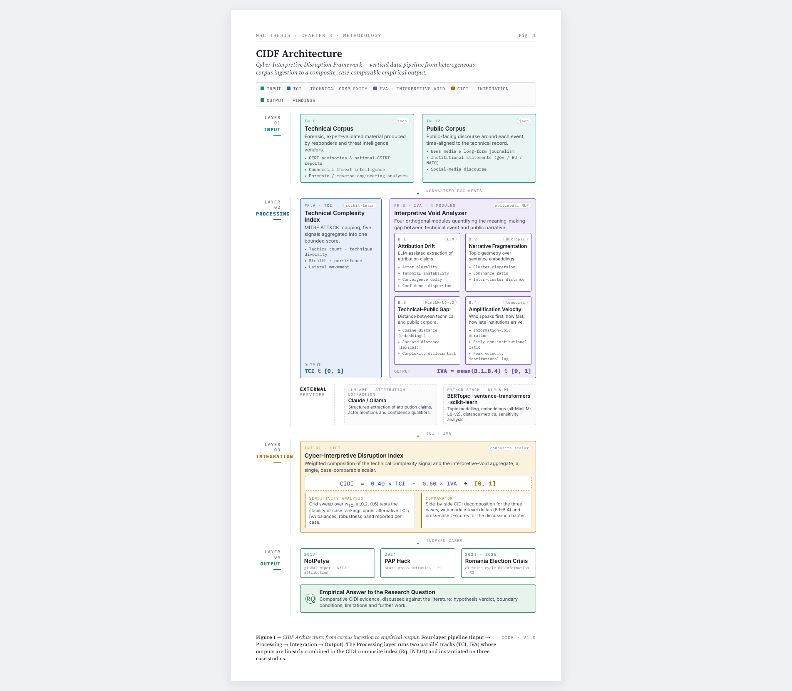

# CIDF — Cyber-Interpretive Disruption Framework

> A computational framework for measuring the relationship between technical complexity of cyber-attacks and communicative disruption in the European public sphere.

**Institution:** LUISS Guido Carli — Department of Political Science  
**Thesis:** The Interpretive Void: Technical Complexity, Crisis Communication and Narrative Competition in European Cyber Crises  
**Supervisor:** Prof. Donatella Selva  
**Author:** Giovanni Arosio  
**Academic Year:** 2025/2026  

---

## Academic Context

This framework was developed as the empirical component of a Master's thesis in International Relations / Security Studies. The research investigates how the technical complexity of cyber-attacks shapes crisis communication processes and narrative competition within the European public sphere — generating what the thesis terms the "interpretive void."

The CIDF operationalizes this relationship through three integrated instruments:

---

## Framework Architecture

*Figure 1 — CIDF Architecture: from corpus ingestion to empirical output.*

---

## Components

### TCI — Technical Complexity Index
Measures the operational sophistication of cyber incidents using the MITRE ATT&CK framework. Parameters include: number and diversity of techniques, stealth level, persistence mechanisms, and lateral movement extent. Output: normalized score 0–1.

### IVA — Interpretive Void Analyzer
A four-dimensional NLP pipeline measuring communicative disruption in the public sphere:
- **Attribution Drift** — instability of responsibility claims over time (LLM-assisted extraction)
- **Narrative Fragmentation** — diversity of competing narratives (BERTopic + sentence embeddings)
- **Technical-Public Gap** — semantic distance between expert and public discourse (sentence-transformers)
- **Amplification Velocity** — speed of non-institutional narrative circulation

Output: composite IVA score 0–1.

### CIDI — Cyber-Interpretive Disruption Index
Integrates TCI and IVA into a single comparative measure:
CIDI = 0.40 × TCI + 0.60 × IVA

The asymmetric weighting reflects the thesis's core argument: the interpretive dimension carries greater analytical weight because the real impact of cyber-enabled disruptive events lies not in technical sophistication alone, but in the communicative disorder they produce.

---

## Case Studies

| Case | Date | Expected TCI | Expected IVA Pattern |
|------|------|-------------|----------------------|
| NotPetya | June 2017 | High | High initial drift, eventual convergence |
| PAP Hack | May 2024 | Low | Intense but short-lived void |
| Romania Election Crisis | Nov 2024 – Jan 2025 | Medium | Deep, unresolved, politically contested |

---

## Data Sources

All corpus documents are drawn exclusively from publicly available sources. No proprietary or scraped data is included. Sources include: CERT advisories, ENISA reports, CISA advisories, Mandiant/CrowdStrike threat intelligence reports, European Parliament documents, mainstream media coverage, and official institutional statements.

---

## Tech Stack

- Python 3.10+
- `bertopic` — topic modeling for narrative fragmentation
- `sentence-transformers` — semantic embeddings (all-MiniLM-L6-v2)
- `scikit-learn` — clustering and metrics
- `anthropic` — LLM-assisted attribution extraction
- `streamlit` + `plotly` — interactive dashboard
- `pandas`, `numpy` — data processing

---

## Repository Structure
cidf-framework/
├── data/           # Corpora (JSON) for each case study
├── tci/            # Technical Complexity Index module
├── iva/            # Interpretive Void Analyzer (4 modules)
├── cidi/           # CIDI integration and sensitivity analysis
└── dashboard/      # Streamlit visualization app

---

## Citation

If you use this framework in your research, please cite:

> Arosio, G. (2026). *The Interpretive Void: Technical Complexity, Crisis Communication and Narrative Competition in European Cyber Crises*. Master's Thesis, LUISS Guido Carli.

---

*This project is released under the MIT License for academic and research purposes.*
